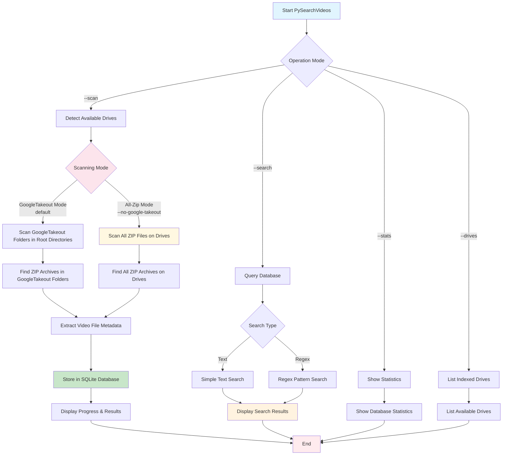

# PySearchZips

A high-performance Python tool for scanning and indexing files within ZIP archives across multiple drives and storage locations. Originally designed for Google Takeout video archives, it now supports scanning ANY file type with advanced filtering, parallel processing, and duplicate detection.

## Features

### Performance & Scanning
- **Parallel processing**: Multi-threaded scanning with configurable worker count
- **Incremental updates**: Only scan modified ZIP files for fast re-indexing  
- **Memory-efficient**: Configurable memory limits for large archive processing
- **Batch operations**: Optimized database insertions for maximum speed

### Flexible File Support
- **Any file type**: Videos (default) or ALL files in ZIP archives (`--all-files`)
- **Multiple scanning modes**:
  - **GoogleTakeout mode** (default): Scans GoogleTakeout folders in root directories
  - **All-zip mode**: Comprehensive scanning of all ZIP files across drives
- **Smart filtering**: Filter by file extensions, size ranges, and modification dates

### Advanced Search & Analysis
- **Powerful search**: Text patterns, regex support, and multi-criteria filtering
- **Duplicate detection**: Find identical files using content hashing (MD5)
- **Size-based filtering**: Min/max file size constraints for search results
- **CSV export**: Export search results for analysis in spreadsheets

### Configuration & Customization
- **Auto-configuration**: Copies default settings to local `config.json` on first run
- **Drive/folder exclusion**: Skip specific drives or directory patterns
- **Extensible**: Custom video extensions and excluded directory patterns
- **Multiple databases**: Support for multiple database files

### User Experience
- **Real-time progress**: Colored progress bars and live status updates
- **Cross-platform**: Windows, Linux, macOS, and Windows Subsystem for Linux (WSL)
- **Database validation**: Integrity checking and repair capabilities
- **Quiet/dry-run modes**: Silent operation and preview modes

## Workflow



## Supported Video Formats

mp4, avi, mov, mkv, wmv, flv, webm, m4v, 3gp, 3g2, asf, divx, f4v, m2ts, mts, ogv, rm, rmvb, vob, xvid, mpg, mpeg, m1v, m2v

## Requirements

- Python 3.6+
- Optional: `colorama` package for colored terminal output

## Installation

Clone the repository and optionally install colorama for enhanced output:

```bash
git clone <repository-url>
cd PySearchVideos
pip install colorama  # Optional, for colored output
```

## Usage

### Quick Start

```bash
# First run: Auto-creates config.json from defaults
./py_zip_scanner.py --scan

# Search for videos with "vacation" in the name
./py_zip_scanner.py --search "vacation"

# Find all .txt files in ZIP archives
./py_zip_scanner.py --search ".txt" --file-types txt --all-files
```

### Scanning Modes

#### GoogleTakeout Mode (Default)
```bash
./py_zip_scanner.py --scan
```
- Scans GoogleTakeout folders in root directories of all drives
- Fast, focused scanning for Google Takeout archives
- Stores results in `zip_files.db`

#### All-ZIP Mode  
```bash  
./py_zip_scanner.py --scan --no-google-takeout
```
- Comprehensive scan of ALL ZIP files across ALL drives
- **Warning**: Significantly longer scan time
- Useful for complete archive inventories

#### All File Types
```bash
./py_zip_scanner.py --scan --all-files --no-google-takeout
```
- Scans ALL file types in ZIP archives (not just videos)
- Perfect for document archives, code repositories, etc.

### Advanced Searching

```bash
# Simple text search
./py_zip_scanner.py --search "vacation"

# Regex search  
./py_zip_scanner.py --search "IMG_\d{4}\.mp4" --regex

# Size-based filtering (files > 100MB)
./py_zip_scanner.py --search ".*" --regex --min-size 104857600

# Search specific file types
./py_zip_scanner.py --search "document" --file-types pdf docx txt --all-files

# Export results to CSV
./py_zip_scanner.py --search "vacation" --export-csv results.csv
```

### View database statistics

```bash
./py_zip_scanner.py --stats
```

### List indexed drives

```bash
./py_zip_scanner.py --drives
```

### Custom database location

```bash
./py_zip_scanner.py --database /path/to/custom.db --scan
```

### Advanced features

#### Configuration Management
```bash
# First run automatically creates config.json from defaults
./py_zip_scanner.py --scan

# Edit your local configuration (gitignored)
nano config.json

# Use automatically (no --config flag needed)
./py_zip_scanner.py --scan

# Use specific config file
./py_zip_scanner.py --config high_performance.json --scan
```

#### Find duplicate videos
```bash
# Find videos with identical content (based on file hash)
./py_zip_scanner.py --find-duplicates
```

#### Export search results
```bash
# Search and export results to CSV
./py_zip_scanner.py --search "vacation" --export-csv results.csv
```

#### Database validation
```bash
# Check database integrity and find missing files
./py_zip_scanner.py --validate-db
```

#### Quiet and dry-run modes
```bash
# Preview what would be scanned without actually scanning
./py_zip_scanner.py --scan --dry-run

# Run in quiet mode with minimal output
./py_zip_scanner.py --scan --quiet
```

### Command line options

```bash
./py_zip_scanner.py --help
```

Available options:
- `--scan`: Start scanning drives for video files
- `--search "pattern"`: Search for video files by name
- `--regex`: Use regex patterns for search
- `--stats`: Show database statistics
- `--drives`: List indexed drives with statistics
- `--database PATH`: Specify custom database location (default: zip_files.db)
- `--config PATH`: Load configuration from JSON file
- `--google-takeout`: Search only GoogleTakeout folders in root directories (default: enabled)
- `--no-google-takeout`: Scan all zip files on all drives and folders (overrides default behavior)
- `--quiet, -q`: Quiet mode - minimal output
- `--dry-run`: Show what would be scanned without actually scanning
- `--exclude-paths`: Additional paths to exclude from scanning
- `--export-csv FILE`: Export search results to CSV file
- `--find-duplicates`: Find and display duplicate video files
- `--validate-db`: Validate database integrity

## Database Schema

The tool creates several tables for enhanced functionality:

- `zip_files`: Stores ZIP archive metadata including file paths, hashes, and modification dates
- `file_contents`: Stores video file metadata with hashing for duplicate detection
- `scan_progress`: Tracks scan progress for resume capability (future feature)
- `scan_metrics`: Stores scanning statistics and performance metrics

## Platform Support

- **Windows**: Scans all available drive letters (C:, D:, etc.)
- **Linux/macOS**: Scans root filesystem and common mount points (/mnt, /media)
- **WSL**: Automatically detects and scans Windows drives mounted at /mnt/c, /mnt/d, etc.

## Output

The tool provides colored terminal output with:
- Real-time progress bars for each drive
- Statistics on folders scanned and files found
- Before/after database comparisons
- Detailed search results with file locations and sizes

## Files

- `py_zip_scanner.py`: Main scanner application
- `test_drives.py`: Test script for drive detection functionality
- `config_default.json`: Default configuration (DO NOT EDIT)
- `config.json`: Local configuration (gitignored, copy from default)
- `zip_files.db`: SQLite database (created automatically)
- `REVIEW.md`: Code review and usage summary
- `EXAMPLES.md`: Comprehensive usage examples