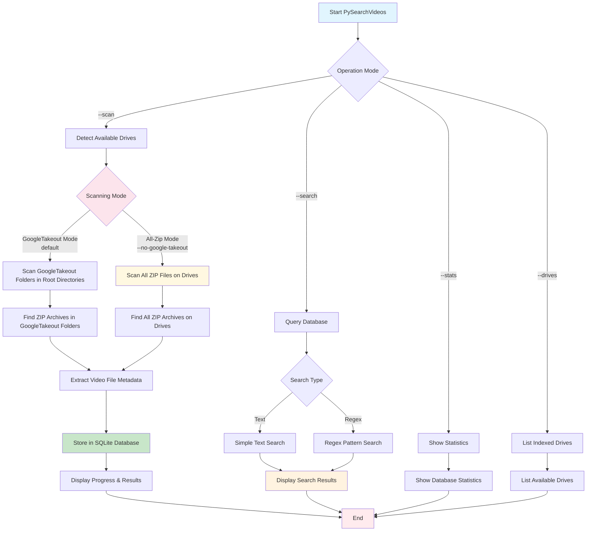

# PySearchVideos

A Python tool for scanning and indexing video files within zip archives across multiple drives and storage locations. Supports two scanning modes: GoogleTakeout folders only (default) or comprehensive scanning of all zip files.

## Features

- **Multi-drive scanning**: Automatically detects available drives on Windows, Linux, macOS, and WSL environments
- **Flexible scanning modes**: 
  - **GoogleTakeout mode** (default): Scans zip files only in GoogleTakeout folders found in root directories of drives
  - **All-zip mode**: Scans all zip files across entire drives when using `--no-google-takeout`
- **Video file indexing**: Scans zip archives for video files with support for 20+ video formats
- **SQLite database**: Stores file metadata in a searchable database
- **Search functionality**: Find videos by filename with optional regex support
- **Progress tracking**: Real-time progress bars and colored output for better user experience
- **Cross-platform**: Works on Windows, Linux, macOS, and Windows Subsystem for Linux (WSL)

## Workflow



## Supported Video Formats

mp4, avi, mov, mkv, wmv, flv, webm, m4v, 3gp, 3g2, asf, divx, f4v, m2ts, mts, ogv, rm, rmvb, vob, xvid, mpg, mpeg, m1v, m2v

## Requirements

- Python 3.6+
- Optional: `colorama` package for colored terminal output

## Installation

Clone the repository and optionally install colorama for enhanced output:

```bash
git clone <repository-url>
cd PySearchVideos
pip install colorama  # Optional, for colored output
```

## Usage

### Scan drives for Google Takeout archives (default mode)

```bash
./py_zip_scanner.py --scan
```

This will:
- Scan all available drives for GoogleTakeout folders in root directories
- Index all video files found in zip archives within GoogleTakeout folders (recursively)
- Store results in `google_takeout_videos.db`

### Scan all zip files on all drives

```bash
./py_zip_scanner.py --scan --no-google-takeout
```

This will:
- Scan ALL zip files on ALL available drives and all folders (comprehensive scan)
- Index all video files found in any zip archive anywhere on the drives
- Store results in `google_takeout_videos.db`
- **Warning**: This mode may take significantly longer and process many more files

### Search for video files

```bash
# Simple text search
./py_zip_scanner.py --search "vacation"

# Regex search
./py_zip_scanner.py --search "IMG_\d{4}\.mp4" --regex
```

### View database statistics

```bash
./py_zip_scanner.py --stats
```

### List indexed drives

```bash
./py_zip_scanner.py --drives
```

### Custom database location

```bash
./py_zip_scanner.py --database /path/to/custom.db --scan
```

### Command line options

```bash
./py_zip_scanner.py --help
```

Available options:
- `--scan`: Start scanning drives for video files
- `--search "pattern"`: Search for video files by name
- `--regex`: Use regex patterns for search
- `--stats`: Show database statistics
- `--drives`: List indexed drives with statistics
- `--database PATH`: Specify custom database location
- `--google-takeout`: Search only GoogleTakeout folders in root directories (default: enabled)
- `--no-google-takeout`: Scan all zip files on all drives and folders (overrides default behavior)

## Database Schema

The tool creates two main tables:

- `zip_files`: Stores information about zip archives
- `file_contents`: Stores metadata for individual video files within archives

## Platform Support

- **Windows**: Scans all available drive letters (C:, D:, etc.)
- **Linux/macOS**: Scans root filesystem and common mount points (/mnt, /media)
- **WSL**: Automatically detects and scans Windows drives mounted at /mnt/c, /mnt/d, etc.

## Output

The tool provides colored terminal output with:
- Real-time progress bars for each drive
- Statistics on folders scanned and files found
- Before/after database comparisons
- Detailed search results with file locations and sizes

## Files

- `py_zip_scanner.py`: Main scanner application
- `test_drives.py`: Test script for drive detection functionality
- `google_takeout_videos.db`: SQLite database (created automatically)