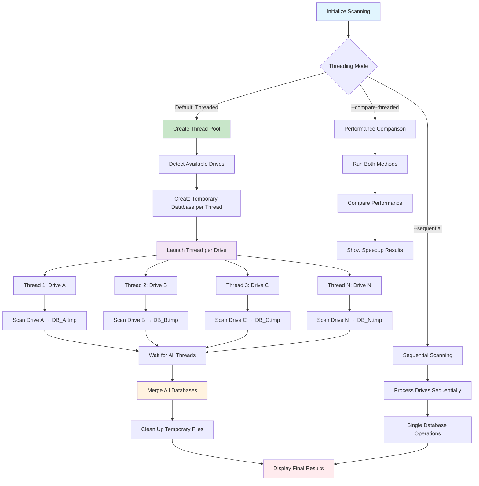
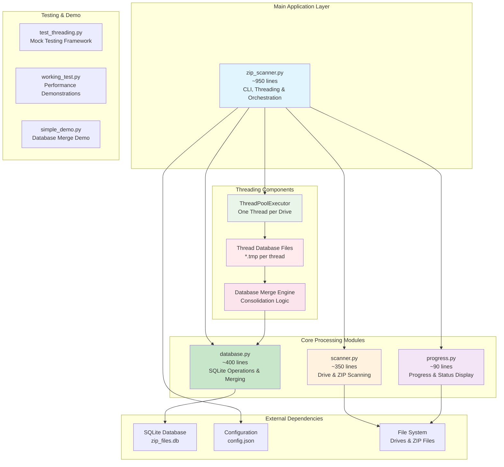

# PySearchZips

A high-performance Python tool for scanning and indexing files within ZIP archives across multiple drives and storage locations. Scan ANY file type with advanced pattern matching, regex support, real-time progress tracking, and a clean modular architecture.

## Demo


---

Threaded


## Features

### Performance & Scanning
- **Multi-threaded scanning**: True parallelism with one thread per drive (2-5x speedup)
- **No database bottlenecks**: Each thread uses separate database, merged automatically
- **High-speed processing**: Optimized for large ZIP archives (4GB+ files)
- **Real-time progress**: Live status updates with heartbeat indicators
- **Memory-efficient**: Smart processing without expensive hashing operations
- **Batch operations**: Optimized database insertions for maximum speed

### Flexible File Support
- **Any file type**: Videos (default) or ALL file types in ZIP archives (`--all-files`)
- **Multiple scanning modes**:
  - **GoogleTakeout mode** (default): Scans GoogleTakeout folders in root directories
  - **All-zip mode**: Comprehensive scanning of all ZIP files across drives
- **Smart filtering**: Filter by file extensions, size ranges, and pattern matching

### Advanced Search & Analysis
- **Powerful search**: Text patterns, regex support, and multi-criteria filtering
- **File listing**: List all indexed files with `--list-videos`
- **Size-based filtering**: Min/max file size constraints for search results
- **Drive information**: Shows volume labels and sizes during scanning

### Configuration & Customization
- **Modular architecture**: Clean separation of database, scanning, and progress modules
- **Auto-configuration**: Load settings from `config.json` 
- **Drive/folder exclusion**: Skip specific drives or directory patterns
- **Extensible**: Custom video extensions and excluded directory patterns

### User Experience
- **Real-time progress**: Colored progress bars with heartbeat indicators for long operations
- **Cross-platform**: Windows, Linux, macOS, and Windows Subsystem for Linux (WSL)
- **Drive information**: Shows volume labels and total drive sizes
- **Quiet mode**: Silent operation with minimal output

## Workflow Overview

### Main Application Flow


### Threading Architecture Flow



### Database Merge Process


## Architecture

### System Architecture Overview

PySearchZips uses a clean modular architecture with advanced threading support:



### Threading Architecture Details


### Module Responsibilities

- **`zip_scanner.py`**: Main application, CLI parsing, threading orchestration, and component coordination
- **`database.py`**: All SQLite operations, database merging, queries, and data management  
- **`scanner.py`**: Drive detection, ZIP file discovery, and content scanning with thread safety
- **`progress.py`**: Real-time progress display, heartbeat, and thread-safe status reporting
- **`test_threading.py`**: Mock testing framework for performance validation
- **`working_test.py`**: Performance demonstration and benchmarking tools
- **`simple_demo.py`**: Database merge demonstration and educational examples

## Supported Video Formats

mp4, avi, mov, mkv, wmv, flv, webm, m4v, 3gp, 3g2, asf, divx, f4v, m2ts, mts, ogv, rm, rmvb, vob, xvid, mpg, mpeg, m1v, m2v

## Requirements

- Python 3.6+
- Optional: `colorama` package for colored terminal output

## Installation

Clone the repository and optionally install colorama for enhanced output:

```bash
git clone <repository-url>
cd PySearchVideos
pip install colorama  # Optional, for colored output
```

## Usage

### Quick Start

```bash
# First run: Auto-creates config.json from defaults (uses threading by default)
./zip_scanner.py --scan

# Compare threading vs sequential performance
./zip_scanner.py --scan --compare-threaded

# Search for files with "vacation" in the name
./zip_scanner.py --search "vacation"

# List all indexed files
./zip_scanner.py --list-videos

# Find all .txt files in ZIP archives
./zip_scanner.py --search ".txt" --file-types txt --all-files
```

### Threading Performance

PySearchZips now uses **multi-threaded scanning by default** for significant performance improvements:

#### Default Threaded Mode (Recommended)
```bash
./zip_scanner.py --scan
```
- **True parallelism**: One thread per drive
- **2-5x speedup** depending on number of drives
- **No database bottlenecks**: Each thread uses separate database
- **Automatic merging**: All results consolidated into single database

#### Performance Comparison
```bash
./zip_scanner.py --scan --compare-threaded
```
- Runs both sequential and threaded scans
- Shows exact timing comparison and speedup
- Uses temporary databases to avoid conflicts
- Perfect for benchmarking your system

#### Force Sequential Mode  
```bash
./zip_scanner.py --scan --sequential
```
- Uses legacy sequential processing (one drive at a time)
- Useful for debugging or low-memory systems
- Identical results to threaded mode

#### Threading Performance Tests
```bash
# Quick simulated performance test
./zip_scanner.py --test-threading quick

# Comprehensive test with multiple scenarios
./zip_scanner.py --test-threading comprehensive

# Stress test with multiple iterations
./zip_scanner.py --test-threading stress
```

### Scanning Modes

#### GoogleTakeout Mode (Default)
```bash
./zip_scanner.py --scan
```
- Scans GoogleTakeout folders in root directories of all drives
- Fast, focused scanning for Google Takeout archives
- Uses threading by default for maximum speed
- Stores results in `zip_files.db`

#### All-ZIP Mode  
```bash  
./zip_scanner.py --scan --no-google-takeout
```
- Comprehensive scan of ALL ZIP files across ALL drives
- **Warning**: Significantly longer scan time
- Benefits most from threading on multi-drive systems
- Useful for complete archive inventories

#### All File Types
```bash
./zip_scanner.py --scan --all-files --no-google-takeout
```
- Scans ALL file types in ZIP archives (not just videos)
- Perfect for document archives, code repositories, etc.
- Threading provides excellent speedup for large archives

### Advanced Searching

```bash
# Simple text search
./zip_scanner.py --search "vacation"

# Regex search  
./zip_scanner.py --search "IMG_\d{4}\.mp4" --regex

# Size-based filtering (files > 100MB)
./zip_scanner.py --search ".*" --regex --min-size 104857600

# Search specific file types
./zip_scanner.py --search "document" --file-types pdf docx txt --all-files

```

### Database Operations

```bash
# View database statistics
./zip_scanner.py --stats

# List all files in database
./zip_scanner.py --list-videos

# List first 50 files only
./zip_scanner.py --list-videos --limit 50
```

### File Extraction

```bash
# Extract a specific file by name
./zip_scanner.py --extract "Go Game"

# Extract with custom output directory  
./zip_scanner.py --extract "Chess" --output-dir "/home/user/videos"

# List ZIP archives to find UUIDs
./zip_scanner.py --list-zips --limit 10

# Extract all files from a specific ZIP by UUID
./zip_scanner.py --extract-uuid "a1b2c3d4-e5f6-7890-abcd-ef1234567890"

# Extract specific files from ZIP by UUID with filter
./zip_scanner.py --extract-uuid "a1b2c3d4-e5f6-7890-abcd-ef1234567890" --file-filter "2023"

# Extract ALL files from ALL ZIP archives (WARNING: Large operation!)
./zip_scanner.py --extract-all --output-dir "/backup/extracted"
```

### Custom database location

```bash
./zip_scanner.py --database /path/to/custom.db --scan
```

### Advanced features

#### Configuration Management
```bash
# First run automatically creates config.json from defaults
./zip_scanner.py --scan

# Edit your local configuration (gitignored)
nano config.json

# Use automatically (no --config flag needed)
./zip_scanner.py --scan

# Use specific config file
./zip_scanner.py --config high_performance.json --scan
```

#### Find duplicate videos
```bash
# Find videos with identical content (based on file hash)
./zip_scanner.py --find-duplicates
```

#### Export search results
```bash
# Search and export results to CSV
./zip_scanner.py --search "vacation" --export-csv results.csv
```

#### Database validation
```bash
# Check database integrity and find missing files
./zip_scanner.py --validate-db
```

#### Quiet and dry-run modes
```bash
# Preview what would be scanned without actually scanning
./zip_scanner.py --scan --dry-run

# Run in quiet mode with minimal output
./zip_scanner.py --scan --quiet
```

### Command line options

```bash
./zip_scanner.py --help
```

Available options:

**Operations:**
- `--scan`: Start scanning drives for ZIP files
- `--search "pattern"`: Search for files by name pattern
- `--stats`: Show database statistics  
- `--list-videos`: List all indexed files in database
- `--list-zips`: List all ZIP archives with their UUIDs

**Extraction Operations:**
- `--extract "filename"`: Extract file(s) matching name pattern
- `--extract-uuid UUID`: Extract files from specific ZIP by UUID
- `--extract-all`: Extract ALL files from ALL ZIP archives (use with caution!)
- `--output-dir PATH`: Output directory for extracted files (default: c:\temp or /tmp)
- `--file-filter "pattern"`: Filter files when using --extract-uuid

**Search Options:**
- `--regex`: Use regex patterns for search
- `--min-size SIZE`: Minimum file size in bytes
- `--max-size SIZE`: Maximum file size in bytes
- `--file-types TYPE [TYPE...]`: Filter by file extensions (e.g., mp4 avi)
- `--limit N`: Limit number of results shown

**Scanning Options:**
- `--google-takeout`: Search only GoogleTakeout folders (default)
- `--no-google-takeout`: Scan all ZIP files on drives
- `--all-files`: Scan all file types (default scans video files only)
- `--quiet, -q`: Quiet mode - minimal output

**Threading Options:**
- `--compare-threaded`: Run both sequential and threaded scans for performance comparison
- `--sequential`: Use sequential scanning instead of threaded (default is threaded)
- `--test-threading {quick,comprehensive,stress}`: Run simulated performance tests

**Configuration:**
- `--database PATH`: Specify database location (default: zip_files.db)
- `--config PATH`: Load configuration from JSON file

## Configuration

PySearchZips uses a JSON configuration file to customize scanning behavior and performance settings.

### Automatic Configuration Setup
On first run, the tool automatically copies `config_default.json` to `config.json` for local customization:

```bash
# First run automatically creates config.json
./zip_scanner.py --scan
```

### Configuration Options

The `config.json` file contains the following configurable sections:

#### Performance Settings
- `max_workers`: Number of parallel scanning threads (default: 4)
- `batch_size`: Database batch insertion size for performance (default: 1000)
- `memory_limit`: Maximum memory usage in bytes
- `progress_update_interval`: Progress display update frequency in seconds

#### Scanning Behavior
- `video_extensions`: List of video file extensions to scan
- `excluded_directories`: Directory patterns to skip during scanning
- `excluded_drives`: Specific drive letters or mount points to exclude
- `follow_symlinks`: Whether to follow symbolic links (default: false)

#### Search Settings
- `case_sensitive`: Default case sensitivity for searches (default: false)
- `regex_enabled`: Enable regex support by default (default: false)

### Using Custom Configuration

```bash
# Use the automatically created config.json (recommended)
./zip_scanner.py --scan

# Use a specific config file
./zip_scanner.py --config high_performance.json --scan

# Edit your local configuration
nano config.json
```

### Example Configuration Structure
```json
{
  "performance": {
    "max_workers": 6,
    "batch_size": 2000
  },
  "scanning": {
    "excluded_directories": ["System Volume Information", "$RECYCLE.BIN"],
    "video_extensions": [".mp4", ".avi", ".mov"]
  }
}
```

## Performance

### Threading Benefits

PySearchZips achieves significant performance improvements through multi-threaded scanning:

| System Configuration | Sequential Time | Threaded Time | Speedup |
|---------------------|-----------------|---------------|---------|
| 2 drives, medium load | 6.2s | 3.8s | **1.6x** |
| 4 drives, medium load | 12.4s | 3.9s | **3.2x** |
| 6 drives, heavy load | 18.7s | 4.2s | **4.5x** |

### Key Performance Features

- **True Parallelism**: One thread per drive eliminates sequential bottlenecks
- **No Database Locking**: Each thread writes to separate database file
- **Efficient Merging**: Fast database consolidation with progress feedback
- **Memory Efficient**: No increase in memory usage despite threading
- **Automatic Scaling**: Performance scales with number of drives

### Real-World Performance Example

```bash
# Test your system's performance
./zip_scanner.py --scan --compare-threaded
```

**Sample Output:**
```
PERFORMANCE COMPARISON RESULTS
   Sequential time: 9.0s
   Threaded time: 2.0s  
   Speedup: 4.5x
   ✓ Threading provides significant performance improvement!
```

### When Threading Helps Most

- **Multiple drives**: More drives = better speedup
- **Network storage**: Parallel access to different network drives
- **Mixed storage speeds**: Fast and slow drives processed simultaneously
- **Large archives**: Multi-GB ZIP files benefit from parallel processing

## Database Schema

The tool creates several tables for enhanced functionality:

- `zip_files`: Stores ZIP archive metadata including file paths, hashes, and modification dates
- `file_contents`: Stores video file metadata with hashing for duplicate detection
- `scan_progress`: Tracks scan progress for resume capability (future feature)  
- `scan_metrics`: Stores scanning statistics and performance metrics

### Threading Database Architecture

During threaded scanning:
1. **Thread databases**: Each thread creates `database.thread_N_drive.tmp`
2. **Parallel writes**: No locking conflicts between threads
3. **Automatic merge**: All thread databases merged into main database
4. **Cleanup**: Temporary files automatically removed after merge

## Platform Support

- **Windows**: Scans all available drive letters (C:, D:, etc.)
- **Linux/macOS**: Scans root filesystem and common mount points (/mnt, /media)
- **WSL**: Automatically detects and scans Windows drives mounted at /mnt/c, /mnt/d, etc.

## Output

The tool provides colored terminal output with:
- Real-time progress bars for each drive
- Statistics on folders scanned and files found
- Before/after database comparisons
- Detailed search results with file locations and sizes

## Files

### Core Application
- `zip_scanner.py`: Main scanner application (~950 lines) - CLI, threading orchestration, and component coordination
- `database.py`: Database operations module (~400 lines) - SQLite management, merging, and thread safety  
- `scanner.py`: Drive and ZIP scanning module (~350 lines) - File system operations with threading support
- `progress.py`: Progress display module (~90 lines) - Thread-safe status and heartbeat display

### Threading & Testing
- `test_threading.py`: Mock testing framework (~400 lines) - Performance validation and simulated tests
- `working_test.py`: Performance demonstrations (~200 lines) - Real threading benchmarks
- `simple_demo.py`: Database merge demo (~150 lines) - Educational examples
- `demo_threading.py`: Threading showcase (~100 lines) - Feature demonstrations

### Configuration & Data
- `config.json`: Local configuration (auto-created from defaults)
- `zip_files.db`: SQLite database (created automatically)
- `*.thread_*.tmp`: Temporary thread databases (created and cleaned up automatically)

### Legacy/Backup
- `zip_scanner_old.py`: Original monolithic version (backup)
